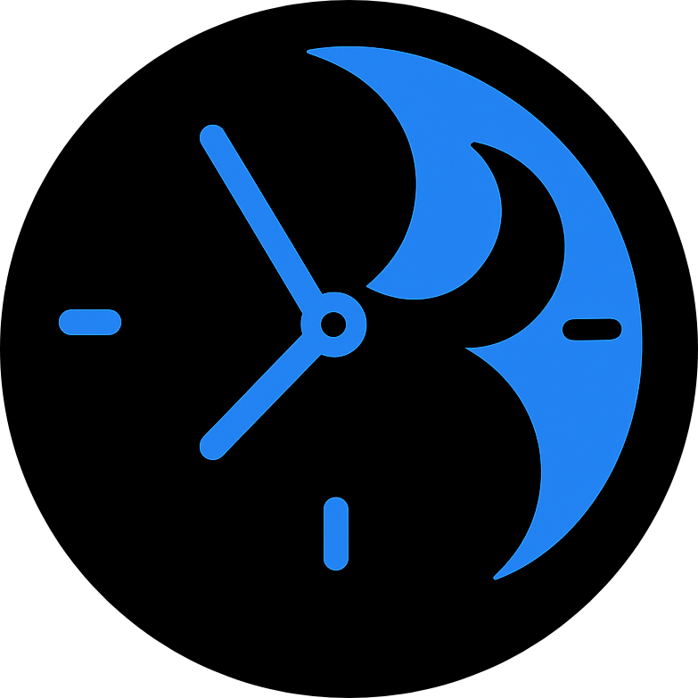
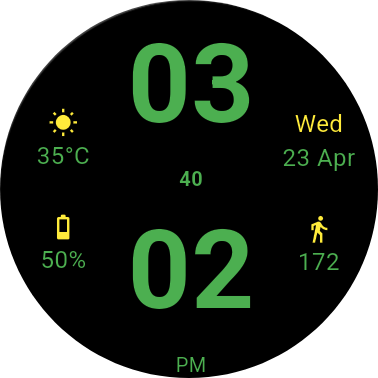
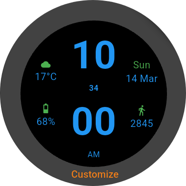
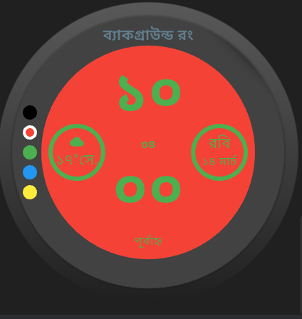
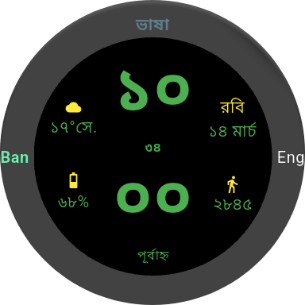
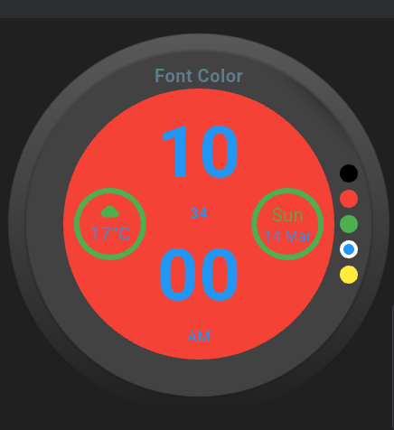
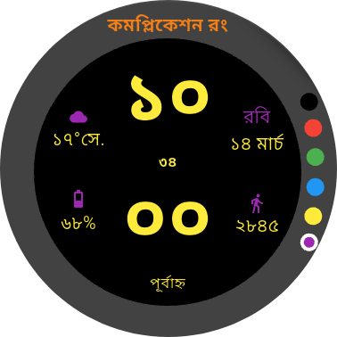

# 🕒 Wear OS – Customizable Watchface App

A simple, elegant and customizable Wear OS application built with Flutter. This app demonstrates core Wear OS functionality including round screen support, rotary input, and responsive design tailored for smartwatches.

## ✨ Features

- 🏠 **Homepage** with long-press detection
- 🎨 **Customization Mode**: Choose your preferences
  - Background Color
  - Language
  - Font Color
  - Complication Color
- ↔️ Swipeable customization pages
- ↩️ Swipe right to go back to the previous screen
- 🧭 Optimized for round watch screens
- 🪄 Minimal & intuitive UI for small screens


## 🖼️ Demo

| Home | WatchFace | Customization Prompt |
|------|-----------|----------------------|
|  |  |  | 

| Swipable Pages |
|----|----|----|----|
|  |  |  |  |


## 🚀 Getting Started

### Prerequisites

- Flutter 3.10+
- Android Studio or VS Code
- Android SDK with Wear OS Emulator or physical watch

### Installation

```bash
git clone https://github.com/Nowshin58/wearOS.git
cd wearOS
flutter pub get
